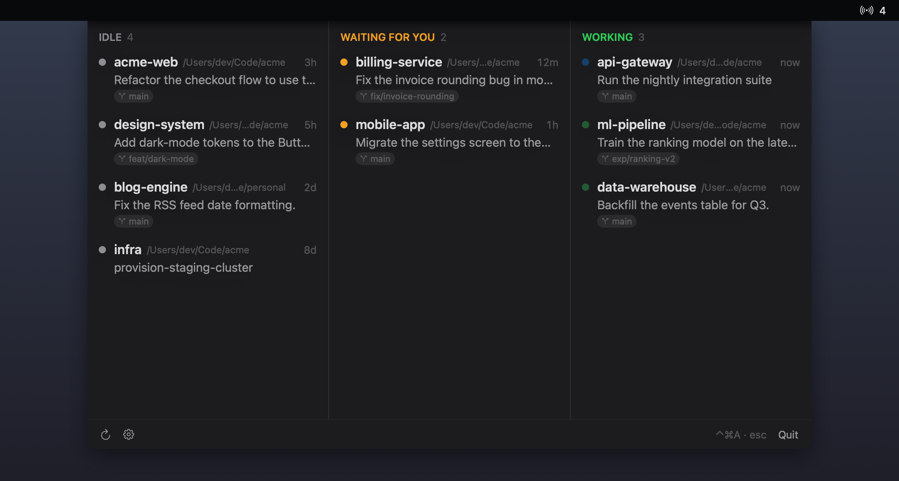
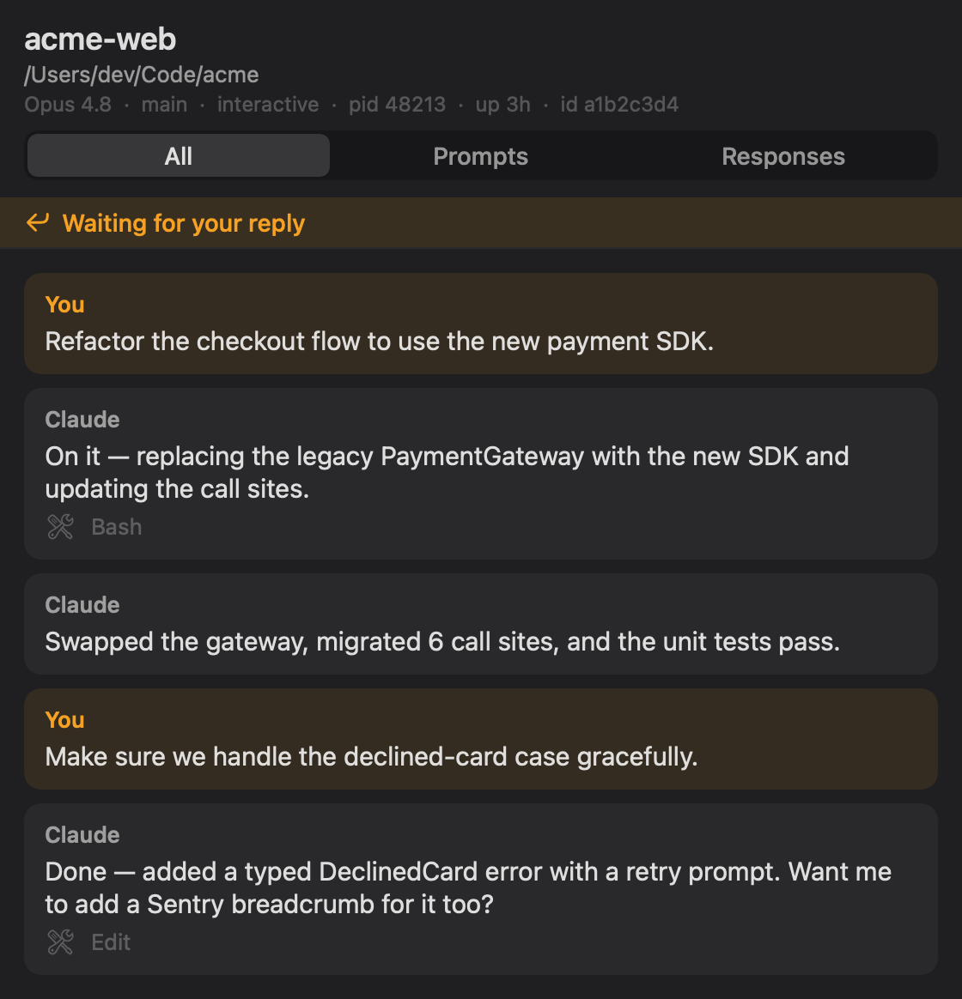

# Agent Monitor

A small, native macOS menu-bar app to see every **Claude Code** session running on your Mac — what each is working on, and which ones are waiting on you — all locally, no network.

<p align="center">
  
</p>

> Screenshots use fictional sample data. The live app shows your actual sessions.

## Why

If you keep several Claude Code sessions open at once — different repos, background jobs, long-running tasks — there's no single place to glance at what's busy, what's idle, and what needs you. This is that place, built around four at-a-glance questions: **which directory**, **the last prompt**, **the status**, and **is it waiting on me?**

## What you see

A dropdown that emerges from behind the menu bar, centered at the top of the screen, with three columns:

- **Idle** — sessions sitting quietly, plus finished background jobs.
- **Waiting for you** — idle sessions whose last message ended by asking you something (amber).
- **Working** — busy right now: green for an interactive session, blue for a running background job (with a gentle live pulse).

Each row shows the **folder**, the **last prompt**, the **directory** and **git branch**, a **status dot**, and the **relative last-active time**. Each column shows up to five rows before scrolling, and empty columns stay visible. The menu-bar icon carries a badge of how many agents are active.

Click any row to open its **transcript window** — a dark, readable view of the conversation that follows new turns live, flags when a session is waiting for your reply, and can filter to just your prompts or just the responses.

<p align="center">
  
</p>

### Optional global shortcut

Off by default. Open **Settings** (the gear in the dropdown footer), enable it, and record a key combo to toggle the dropdown from anywhere; press it again, click away, or hit **Esc** to dismiss.

## Build & run

SwiftPM executable — no Xcode project needed:

```bash
swift build            # compile
swift run AgentMonitor # launch (status-bar only; no Dock icon)
swift test             # run the unit suite (parser, grouping, decoding, polling)
```

To install it as a double-clickable, menu-bar-only `.app`:

```bash
./scripts/make-app.sh   # builds AgentMonitor.app (ad-hoc signed, LSUIElement)
open AgentMonitor.app
```

Requires **macOS 14+** and a `claude` binary (resolved from `~/.local/bin`, Homebrew, `/usr/local/bin`, or `~/.claude/local`). No third-party dependencies.

## How it works

Two local data sources (full detail in [`docs/DISCOVERY.md`](docs/DISCOVERY.md)):

1. **`claude agents --json --all`** — the supported, TTY-free CLI surface that lists every session with `sessionId`, `cwd`, `kind`, and live `status`. Polled **adaptively** — ~10s while anything is active or you're looking, backing off to 30s when everything is idle.
2. **`~/.claude/projects/*/<sessionId>.jsonl`** — each session's append-only transcript, resolved by globbing the unique `sessionId`, parsed defensively, and watched live via `DispatchSource`. Reads are cached per file size, so unchanged transcripts aren't re-read.

There's no push API and no server-side copy — the app polls status and watches transcript files locally.

### Architecture

- **`AgentMonitorCore`** (library, unit-tested): `AgentSession` decoding, the three-way status grouping, relative-time + poll-interval math, the JSONL `TranscriptParser`, and binary resolution.
- **`AgentMonitor`** (executable): `ClaudeCLI` (process spawn), `TranscriptIO` (glob + tail read), `AgentService` (`@Observable` adaptive poll loop), `TranscriptStore` (history + live watch), `GlobalHotKey` (Carbon), and the SwiftUI views hosted in a custom `NSStatusItem` + dropdown `NSPanel`.

The menu-bar surface is a hand-rolled `NSStatusItem` + borderless `NSPanel` rather than SwiftUI's `MenuBarExtra`, because the latter offers no way to position the popover or open it from a global hotkey.

## Try the data layer without building

The shell script mirrors what the app's services do:

```bash
./scripts/agent-snapshot.sh           # list all sessions, status, transcript paths
./scripts/agent-snapshot.sh web       # follow a session's conversation (by name or id substring)
./scripts/agent-snapshot.sh web -n 40 # print the last 40 turns and exit
```

## Repo layout

```
docs/DISCOVERY.md          how to observe Claude Code agents (read this first)
docs/superpowers/          design spec + implementation plan
scripts/agent-snapshot.sh  shell reference of the core data access
scripts/make-app.sh        package the .app bundle
Sources/AgentMonitorCore/  pure, tested logic (models, parser, grouping, formatting)
Sources/AgentMonitor/      SwiftUI app + IO services
Tests/                     unit tests + JSONL fixtures
```

## Privacy

Local-only and read-only. Transcripts can contain anything you've pasted into a session; Agent Monitor never transmits or logs their contents, and never writes to `~/.claude/`.

## Not built (yet)

Launch-at-login, sub-agent/workflow drill-in, and controlling sessions (sending input, killing) are intentionally out of scope.

## License

[MIT](LICENSE).
